# Programa Conversor de Moedas e Medidas

Apresento o **Programa Conversor de Moedas e Medidas** versão 1.0 desenvolvido em Java e Swing para dispositivos desktop. Esse projeto foi um desafio proposto pelo programa <a href="https://www.oracle.com/br/education/oracle-next-education/" target="_blank">ONE - Oracle Next Education</a> da Turma 5 em parceria com a <a href="https://www.alura.com.br/" target="_blank">Alura</a>, para desenvolvemos um conversor de moedas e, como desafio extra, foi proposto agregar outro tipo de conversor, ambos desenvolvidos utilizando a linguagem Java.

Este aplicativo oferece uma solução prática e eficiente para converter diferentes moedas e unidades de medida.

## Conversor de Moedas

Com o conversor de moedas você pode facilmente converter moedas com o câmbio em tempo real, graças a uma API fornecida pelo site <a href="https://docs.awesomeapi.com.br/" target="_blank">AwesomeAPI</a> que atualiza as taxas de câmbio constantemente pela internet. As seguintes conversões estão disponíveis:

- Dólar USD para Real BRL
- Euro para Real BRL
- Libra Esterlina para Real BRL
- Peso Argentino para Real BRL
- Peso Chileno para Real BRL
- Real BRL para Dólar USD
- Real BRL para Euro
- Real BRL para Libra Esterlina
- Real BRL para Peso Argentino
- Real BRL para Peso Chileno

Com essa variedade de opções, você pode converter seus valores monetários com facilidade e confiança.

## Conversor de Medidas

O conversor de Medidas é uma ferramenta versátil que permite a conversão entre diversas unidades de medida. Você pode converter entre elas as seguintes unidades:

- Milímetro
- Centímetro
- Metro
- Quilômetro
- Polegada
- Pés

## Requisitos para rodar a aplicação

- Java Runtime Environment (JRE) 1.8 ou superior

- Sistema Operacional: Windows, macOS e Sistemas Baseado em Linux

- Requisitos de Hardware: Processador de pelo menos 2 núcleos | Memória RAM Recomendada de 4GB de RAM | Espaço em Disco de 50MB para a Aplicação Java e 150 MB a 200 MB para o Java Runtime Environment (JRE). OBS: o espaço ocupado pelo JRE pode variar dependendo do sistema operacional, da arquitetura (32 bits ou 64bits) e das opções selecionadas durante a instalação.

- Conversor de Moedas necessita de conexão com a internet

## Projeto Open Source

Vale ressaltar que o Programa Conversor de Moedas e Medidas foi desenvolvido como um projeto open source. Isso significa que o código-fonte está disponível para a comunidade, permitindo que outros desenvolvedores possam contribuir, melhorar e customizar o aplicativo de acordo com suas necessidades. O autor Luciano Passos demonstra seu comprometimento com a transparência e colaboração, permitindo que outros interessados aprendam, contribuam e ampliem o projeto.

-Você pode encontrar mais detalhes e colaborar com o projeto através do repositório no <a href="https://github.com/lucdospassos/conversor-challenge-one" target="_blank">https://github.com/lucdospassos/conversor-challenge-one</a>.

-Outros projetos: <a href="https://github.com/lucdospassos" target="_blank">https://github.com/lucdospassos</a>.

Portanto, com o Programa Conversor de Moedas e Medidas, você tem acesso a uma ferramenta completa e de código aberto, que torna suas conversões de moeda e medidas mais fáceis e eficientes. Desfrute dessa solução prática e atualizada para suas necessidades cotidianas!

## Desenvolvedor

- Luciano Passos
- [E-mail: lucdospassos@hotmail.com](mailto:lucdospassos@hotmail.com)

## Imagens do Programa

**A seguir, algumas imagens do programa em execução:**

### Conversor de Moedas

<table>
  <tr>
    <td>
      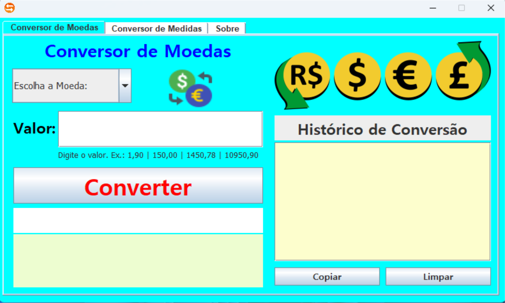
    </td>
    <td>
      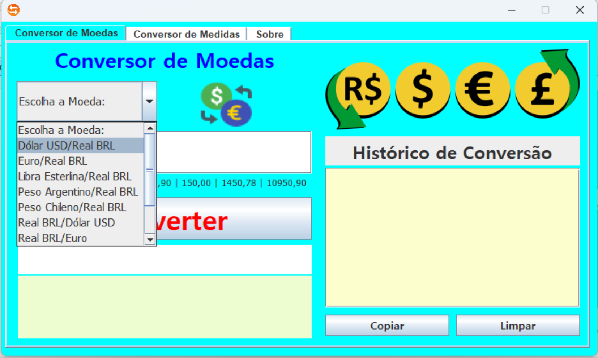
    </td>
  </tr>
  <tr>
    <td>
      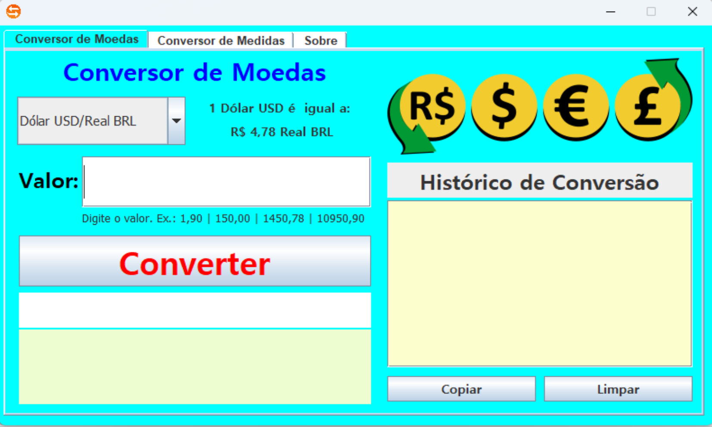
    </td>
    <td>
      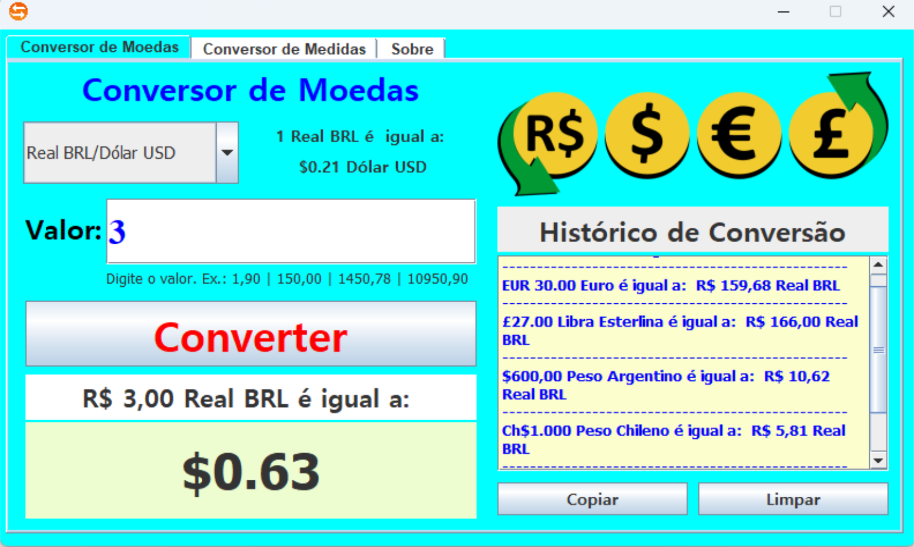
    </td>
  </tr>
  <tr>
    <td>
      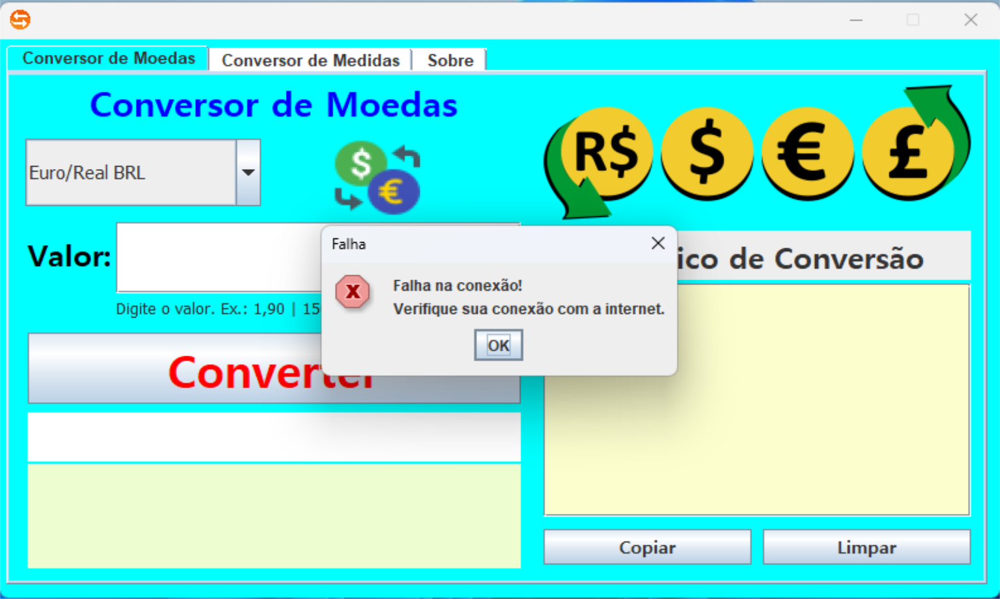
    </td>
    <td>
      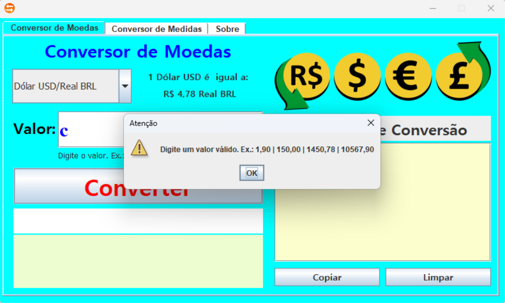
    </td>
  </tr>
</table>

### Conversor de Medidas

<table>
  <tr>
    <td>
      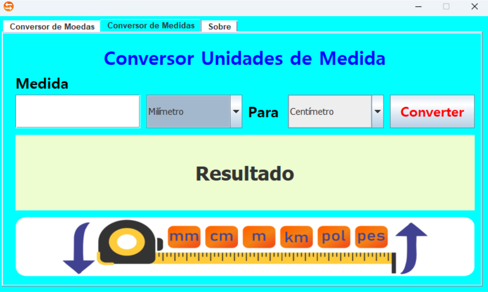
    </td>
    <td>
      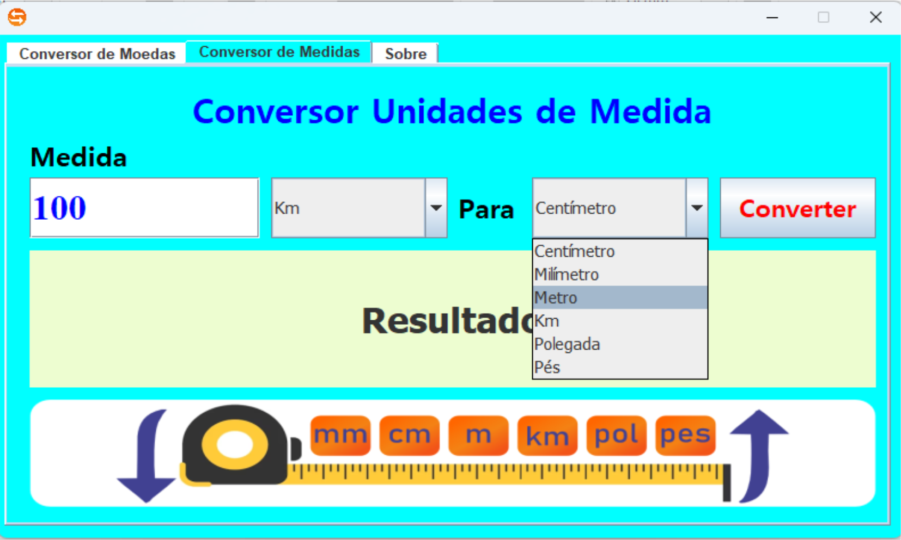
    </td>
  </tr>
  <tr>
    <td>
      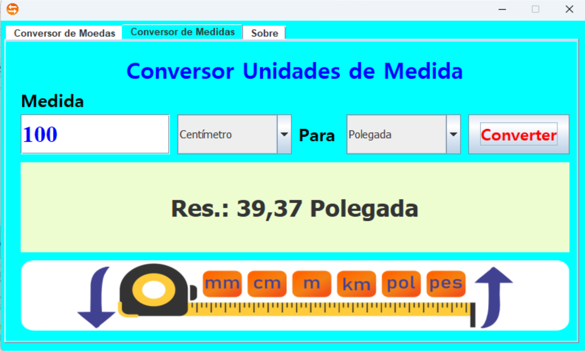
    </td>
    <td>
      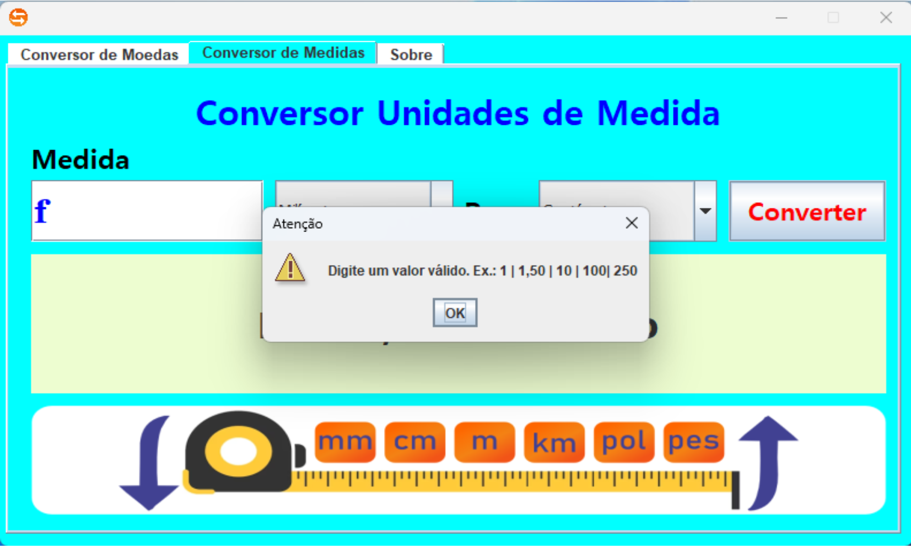
    </td>
  </tr>
</table>

### Sobre

11. 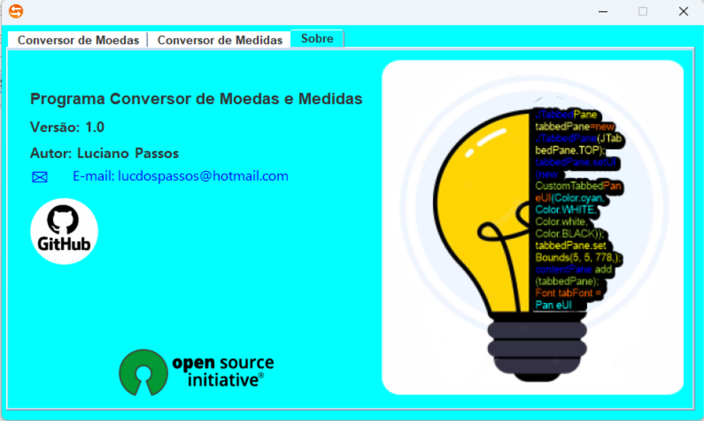

*Nota: As imagens apresentadas são apenas ilustrativas e podem sofrer alterações nas futuras versões do programa.*

---

*Este README foi criado utilizando Markdown. Para visualizar a formatação correta, recomendamos o uso de um visualizador compatível com Markdown.*
